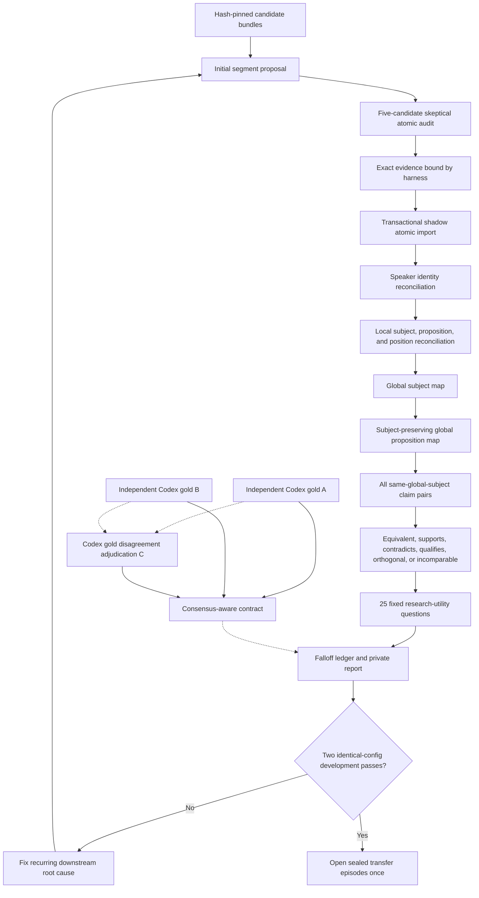

# AI-Safety True-North Downstream Benchmark

This lab is an isolated, private benchmark for the pipeline after frozen
discourse-event candidate extraction. It reads the authoritative factory
database in SQLite read-only mode and writes only to a suite-specific shadow
database under:

`~/Library/Application Support/Podcast Intelligence Factory/true-north/ai-safety-v1`

It never promotes a production release.

## Flow



## Commands

```bash
python3 -m research_factory.pif_cli lab true-north build --suite ai-safety-v1
python3 -m research_factory.pif_cli lab true-north verify --suite ai-safety-v1
python3 -m research_factory.pif_cli lab true-north gold --suite ai-safety-v1
python3 -m research_factory.pif_cli lab true-north gold --suite ai-safety-v1 \
  --execute --partition development --phase atomic --pass pass-a --workers 2
python3 -m research_factory.pif_cli lab true-north run --suite ai-safety-v1 \
  --router spark-first
python3 -m research_factory.pif_cli lab true-north diagnose-atomic \
  --suite ai-safety-v1 --run-id RUN_ID
python3 -m research_factory.pif_cli lab true-north prompt-optimize \
  --suite ai-safety-v1 --arm balanced-boundaries \
  --episode-id DEVELOPMENT_EPISODE_ID
python3 -m research_factory.pif_cli lab true-north score --suite ai-safety-v1 \
  --run-id RUN_ID
python3 -m research_factory.pif_cli lab true-north report --suite ai-safety-v1 \
  --run-id RUN_ID
```

Gold is deliberately layered. For development, execute `pass-a`, `pass-b`,
`pass-c`, then `compile` for each phase in this order:

1. `atomic`
2. `canonical`
3. `canonical-subjects`
4. `canonical-propositions`
5. `relations`
6. `utility`

Passes A and B are independent. Pass C is prepared only after both exist and
adjudicates disagreements against the frozen input. `--workers 2` is the
recommended upper bound for the many atomic and relation packets.
Atomic compilation preserves all three interpretations in
`consensus.private.json`:

- `consensus_value`: A and B both retain or revise.
- `consensus_junk`: A and B both reject.
- `consensus_hold`: A and B both hold.
- `contested`: A and B disagree on value state.

Exact `retain` versus `revise` agreement is diagnostic only. For consensus
value, any atomic count between the independently observed minimum and maximum
is acceptable. Contested items are excluded from strict value/junk gates and
may safely remain held. Raw A/B agreement and reject-set overlap remain visible
as diagnostics rather than pretending one adjudication is uniquely objective.
Episode-level canonical packets keep identity output bounded, then a compact
global subject pass reconciles subjects before proposition variants are
reconciled in subject-preserving packets. Do not execute holdout gold or
workhorse runs until the development gate passes.

The complete restart-safe sequence is also available as one command:

```bash
python3 -m research_factory.pif_cli lab true-north gold \
  --suite ai-safety-v1 --all-development --workers 2
```

Use `--episode-id` on `run` for a bounded shakedown. A run that failed after
its atomic commit can continue without replaying accepted work:

```bash
python3 -m research_factory.pif_cli lab true-north run \
  --suite ai-safety-v1 --resume-run-id RUN_ID
```

`diagnose-atomic` scores any validated atomic outputs immediately, including an
intentionally stopped shakedown. This permits model and prompt comparisons
before paying the latency of identity, canonical, relation, and utility stages.

`prompt-optimize` is a development-only GLM 5.2 system-prompt experiment. The
provider, model, temperature, steps, packet bytes, batching, schema, CLI
instruction, validator, and concurrency limit remain invariant. Every packet,
invariant set, system prompt, call receipt, and score is hash-bound. The command
rejects episode IDs outside the development partition and cannot open sealed
holdouts or mutate production or shadow semantic rows.

Prompt selection uses episode folds. Weak prompts are eliminated on a small
tuning episode. A survivor must reproduce on a second tuning episode that
contains junk examples, then is opened once on a previously untouched
development validation episode. A validation failure stops iteration instead
of converting that episode into more tuning data. The two sealed transfer
episodes remain unavailable until the normal development gate passes.

Validated initial and five-candidate atomic-audit packets are reused by packet
hash across later runs. The small audit packets are deliberately skeptical of
the segment proposal so compound boundaries are reconsidered instead of merely
rubber-stamped. Independent atomic-audit, relation, and utility calls run with a
bounded concurrency of four; database imports remain ordered and
transactional. Semantic packets must account for every input as a decision or
explicit abstention. A semantic or schema validation failure gets at most two
corrective retries on the same provider, with the exact local validation error;
it never triggers model fallback.

Local claim subjects are globally reconciled before relation selection.
Proposition variants are then reconciled only within their resulting global
subject, preserving scope while allowing cross-episode canonicals. Every
complete run answers the frozen 25 questions in separate deterministic
cross-episode retrieval packets and records exact supporting claim IDs. The
bounded per-question design keeps both gold and workhorse packets below CLI
input limits. Utility support is scored at the frozen parent-candidate level so
two valid atomic decompositions are not penalized merely for using different
indices.

## Frozen and mutable boundaries

- Transcript, segment, candidate, episode-context, prompt, schema, router, and
  model configuration hashes are frozen in the suite manifest.
- The alternate Latent Space transcript is excluded and verified absent.
- Evidence text and offsets are never generated by a model. The harness binds
  exact parent-candidate evidence after semantic validation.
- Transport identifiers and hashes are also harness-bound. Opaque-ID repair is
  allowed only when the in-scope target is uniquely determinable.
- Spark is primary. GLM fallback is permitted only after a transport-level
  operational failure. Model answer text cannot trigger fallback.
- The benchmark identity schema excludes provisional `candidate` decisions
  because benchmark outputs are immediately imported into an accepted shadow
  review state. Production reconciliation schemas and model allowlists remain
  unchanged.
- Gold and holdout artifacts remain private. Reports contain identifiers,
  counts, metrics, hashes, timing, and usage—not transcript text.

## Gate behavior

The holdout command fails closed until two scored development runs pass with
the same configuration hash. Research utility (`22/25`) is the primary
certification gate. It must pass together with safety and core-value gates:
consensus junk containment, retained-value recall, acceptable atomic ranges,
speaker correctness, false-merge protection, exact evidence, provenance,
relations, and zero unsupported answers. Exact `retain/revise` and exact
single-decomposition metrics remain diagnostic. A score is unavailable until
the corresponding preferred and consensus gold are compiled. A mechanical
report may still be generated for an unscored shakedown, but it is explicitly
marked not passed.
