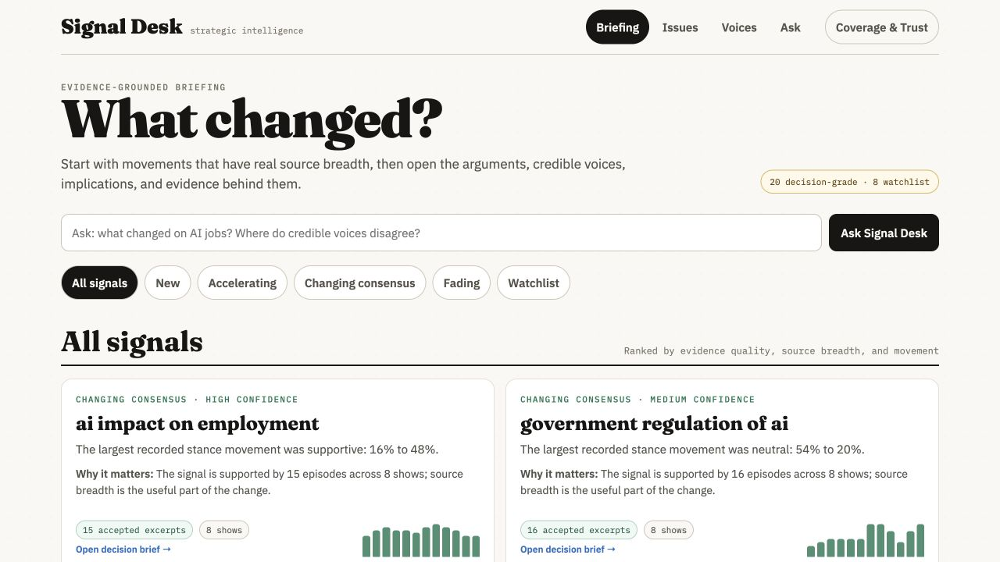
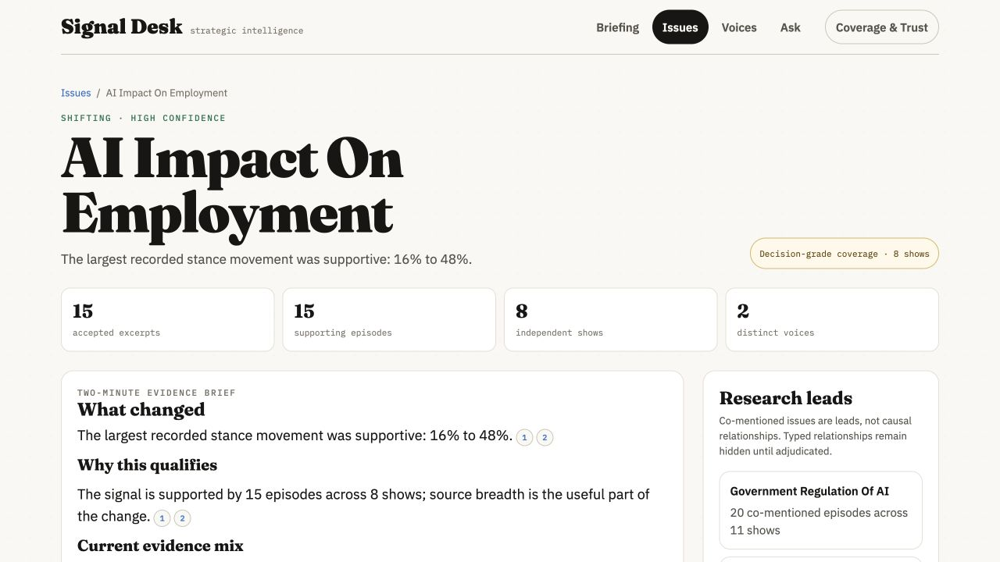
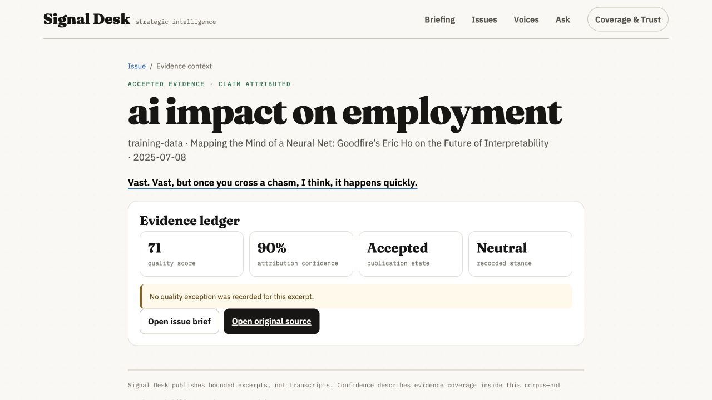
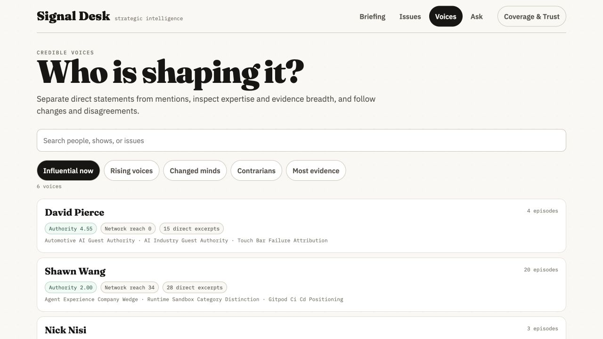
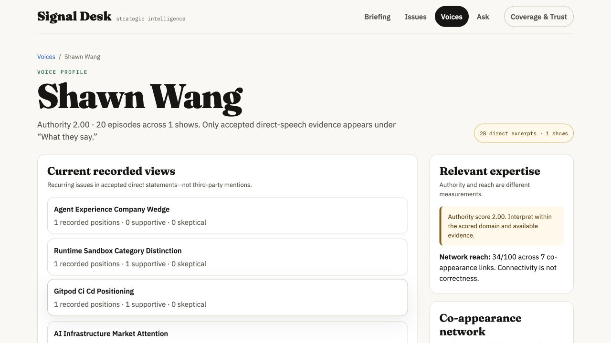
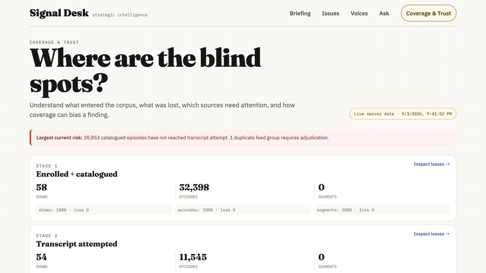
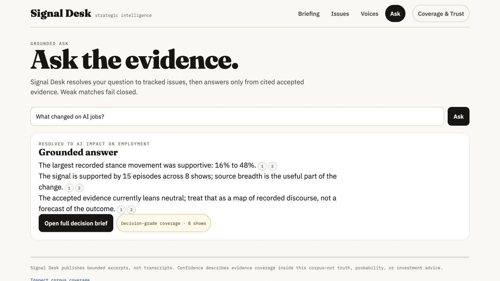
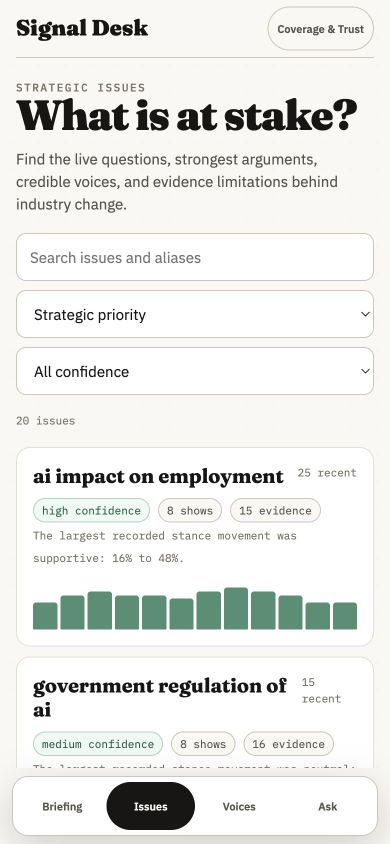

# Live product audit — September 4, 2026

## Scope and evidence

Audited the actual Railway site, then inspected the currently served JSON and source code. Accepted screenshots are retained in `screenshots/` beside this report (working captures in `work/design-audit-20260904/`); they depict the existing product, not a mock. The public snapshot reports generated September 3, data through August 26, latest episode September 3. These are three different clocks.

Railway read-only status independently confirms project `3090c8b2-061b-4818-8d38-47d6b27909d8`, service `82d5e774-bb35-4534-b927-bfcd7c5ea572` (`signal-desk`), production environment `14d11423-83ba-42a9-9ff1-a04ee5195691`, source `kolbydayley/pif-factory`, branch `codex/pif-working-system-rebuild-20260720`, root `/site`, successful deployment `fe3481b8-57a0-4393-8cc4-66f84c072277` at commit `2bb968cf091e0b2fe61b8f259fe25056132eab04`.

## Journey findings

| Step | Surface and evidence | Health | Keep | Highest-value change |
|---|---|---|---|---|
| 1 | Briefing, `01-briefing.png` | Attractive, semantically misleading | Editorial identity, card affordances, clear navigation | 'Accelerating' includes zero-recent-mention topics; relevance needs comparable periods and evidence-backed interpretation |
| 2 | AI employment issue, `02-issue.png` | Layering works; claims remain weak | Issue route, restrained panels, evidence and chart access | First viewport dominated by large title and count tiles; repeated stance statistic does not explain the employment argument |
| 3 | First evidence context, `03-evidence.png` | Critical trust gap | Dedicated evidence route and original-source link | 'Read context' repeats a short fragment with no context; quality 71/attribution 90% creates unjustified reassurance |
| 4 | Voices directory, `04-voices.png` | Scanable but ambiguous | Compact rows and separate voice navigation | Authority 4.55/2.00 lacks readable basis; 'Rising' sorts connectivity, not change |
| 5 | Shawn Wang profile, `05-voice.png` | Rich structure, poor substantive entry | Direct/mentioned separation and source access | Six 'current views' are taxonomy labels and disabled buttons; lead with consequential supported statements |
| 6 | Coverage, `06-coverage.png` | Useful operational foundation | Shows/episodes/segments separated; canonical/raw counts; searchable roster | Snapshot called live; segment conversions before segmentation are meaningless; stage clicks only choose generic filters |
| 7 | Ask employment question, `07-ask.png` | Resolves issue, does not answer intent | Short question flow and source links | Reuses identical generic brief regardless of question; label issue lookup honestly until grounded answer contract exists |
| 8 | Issues at 390px, `08-issues-mobile.png` | Strong readable mobile base | Existing off-white palette, full-width preview, 44px-class controls, bottom nav | Header/search/sorts consume half the viewport; improve density without abandoning chart previews |
| 9 | August issue slice, `09-month-mobile.png` plus DOM | Working evidence filter, inconsistent scope | Month buttons and selected state | Shows one August excerpt while total counts, summary, opposing evidence remain whole-issue without clear scope |

The exact first evidence fragment on the issue page does not state the displayed 16%→48% statistic. Its original source is an audio URL without a location anchor. Therefore a clickable citation is insufficient proof of the aggregate statement. This audit makes no new claim about what the speaker intended; resolving that requires source context.

The inspected voice profile contains an excerpt reporting another person's statement and another containing multiple named turns. The present 'direct speech verified' presentation is too strong to establish that every included sentence is that person's own view. The rebuild's explicit speaker/quoted/mentioned roles are essential; this presentation lane must not improvise new attribution.

## Code-confirmed problems

- `issueSort('rising')` sorts latest share, not share change.
- `voiceRows('rising')` sorts network reach, not rising influence.
- `renderCoverage(filterType, filterValue)` accepts issue/voice scope but does not apply it.
- Stage buttons map stage <2 to needs-attention and the remainder to quarantine, not real loss memberships.
- `renderIssue` filters the evidence list by month but positive/negative selections use the full issue.
- Voice `Read context` controls pass issue origin instead of voice origin.
- `renderEvidence` renders absent context silently; large metadata scores imply more validation than is shown.
- `render()` focuses and scrolls after asynchronous reads without a render-generation guard; stale navigations can overwrite newer views.
- Searches re-render the entire view on every input; cursor/focus and coverage intake state can be lost.
- Coverage refresh re-renders the entire form every 60 seconds, risking erased draft input.
- Briefing hard-caps at 16 despite a displayed total of 28. Issue/voice directories cap at 80 with no next-page control (not triggered by today's small published indexes, but a growth defect).
- The issue payload is ~7.9 MB and voice payload ~3.4 MB uncompressed. One evidence detail fetches both; source payload splitting is valuable but still too coarse at scale.
- Current publishing checks schema, freshness and nonempty issues, not the new clean-corpus approval receipt. Presentation deployment must not be described as clean-corpus approval.

## Preservation decision

Keep Fraunces/IBM Plex, off-white/ink, muted green/gold, thin rules, compact issue rows, existing chart metaphor, readable evidence panels, stable issue/person/evidence hashes, alias compatibility, separate trust page, and lazy payload loading. Refine type scale, count density and section order. Replace unsupported labels and generic summaries, not the brand.

## Accessibility and runtime limits

390px DOM reported document width=390 and scroll width=390. Existing primary controls and month buttons expose names and selected states. Empty issue search correctly displays zero results and a recovery explanation. No browser console errors were observed in the inspected session. Some native AX/screenshot commands timed out; browser-native DOM and screenshot capture succeeded. Those tooling timeouts are not evidence of a website crash.

This is not a WCAG compliance certification. Dedicated screen-reader testing, measured contrast, complete keyboard traversal, 200% zoom, forced network failures and all generated route crawling remain release checks. The current data does not supply an honestly decision-grade example; the legacy label is not accepted as proof. No enrollment form was submitted and no email/push subscription was created.

## Captured journey

### 1. Briefing — visual foundation worth keeping

### 2. Issue detail — counts dominate the substantive research

### 3. Evidence — source context missing in this example

### 4. Voices — readable rows, unexplained authority

### 5. Voice profile — labels replace substantive views

### 6. Coverage — useful foundation, misleading conversions

### 7. Ask — issue resolution presented as an answer

### 8. Mobile issue discovery — preserve compact charts

