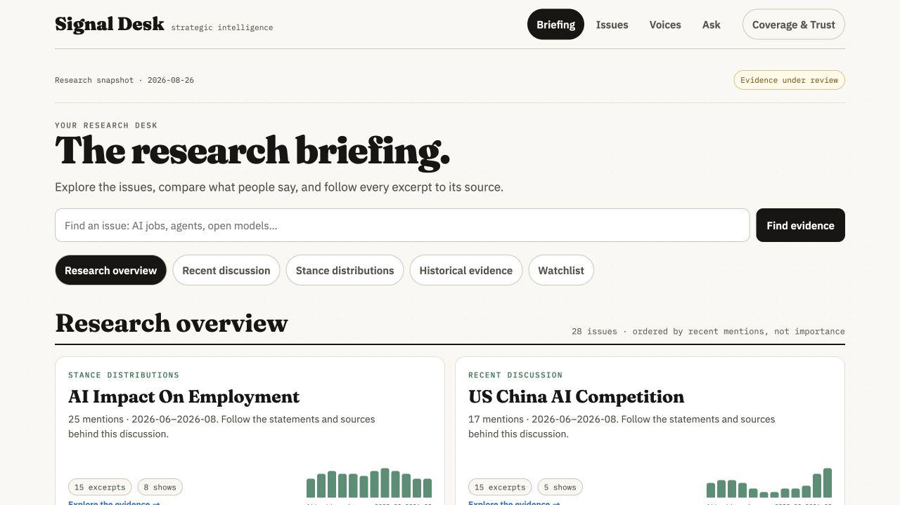

# Presentation release verification

## Implemented

- Preserved the existing Fraunces/IBM Plex identity, off-white/ink palette, muted chart colors, four primary destinations, source roster and stable hash routes.
- Reorganized issue and voice pages around source statements with compact counts, section navigation and expandable depth.
- Made the legacy dataset, dates, attribution gaps and absent source context explicit. Removed unsupported authority/decision-grade assertions and generic 'why it matters' filler from research presentation.
- Classified zero-recent-activity records as historical evidence. Recent-count dates use the global corpus window, not the last month present in an individual issue's sparse series.
- Added mobile research-view selection, an accessible month selector and a monthly data table while retaining the chart.
- Aligned month-filtered counts, excerpts and stance examples; preserved origin/filters/scroll when returning from evidence.
- Replaced fake coverage stage drill-downs with honest stage summaries, applicability-aware segment conversions and canonical/raw source explanations.
- Kept source-request drafts intact during filtering and stopped timed refresh from erasing forms. Intake explicitly opens a draft or copies a request; it does not claim enrollment.
- Kept Ask as an honest issue lookup, preserving a path for future approved synthesis.
- Prevented stale asynchronous responses from replacing newer navigation; handled malformed route escapes without a crash.
- Exposed the full briefing list via progressive disclosure rather than silently stopping at sixteen.

## Verified locally

- Nine Node frontend tests passed, including all 28 published issue views, six voice views and 540 reachable evidence views rendered against the packaged public snapshot. These are renderer/data-contract checks, not 574 browser sessions.
- Twelve Python builder/publisher contract tests passed.
- JavaScript syntax and `git diff --check` passed.
- Browser-verified selected month counts (one August excerpt, one source, zero named excerpts), evidence context-missing state, original source links and return to the exact selected month.
- Browser-verified voice-origin evidence return and actual context display when supplied.
- Browser-verified source-request draft survival across roster filter changes, without submitting any request.
- Mobile issue at 390px: document width 390; content width 358 equals client width 358.
- Mobile coverage at 430px: document width 430; content width 398 equals client width 398.
- Mobile briefing at 430px inspected visually; compact selector replaces wrapped chips, original chart metaphor retained.

## Important limits

This is a presentation release, not a clean-corpus release. Public payload JSON is preserved byte-for-byte; no gold, holdout, extraction, scorer, budget, queue or publication gate was changed. The active data lane remains the authority for approving the new corpus.

Substantive cited strategic briefs, adjudicated proposition-level disagreements, verified expertise, meaningful changes of mind, source-scoped loss memberships, forecasts and private notifications remain data/capability dependent. Their page/component/input contracts are specified in `04-architecture-and-data.md`; they are not represented as completed features.

The present corpus still contains questionable fragments and uncertain attribution. The redesign exposes those limitations and source paths; it does not certify the data. No screen-reader compliance or universal accessibility claim is made. Browser verification covers representative flows; the renderer test covers all published generated research entities.

## Deployment receipt

Verified live on 2026-09-04: Railway deployment `1751f45f-79cb-4819-b5f3-ba1e1f8daf99` reports `SUCCESS` on the existing `signal-desk` production service. Code commits: `c6ff4a0` (research and presentation) and `a59b19c` (content-versioned assets).

[Open Signal Desk](https://signal-desk-production-edf4.up.railway.app/pif-signal-desk.html). HTML, JavaScript, CSS and all five companion JSON payloads returned HTTP 200 and matched the isolated release bytes. All five JSON files also matched the pre-release production data. See [machine-readable receipt](production-receipt.json).

Production browser verification confirmed the redesigned briefing, issue detail, August filter, excerpt provenance/missing-context state, and return with the selected month retained. Asset content hashes in HTML resolve the stale JavaScript observed in a returning browser. The source builder now emits those versions on future builds.

Deployment note: the initial upload failed before replacing the live service because its archive omitted the configured `site/` root. The successful releases used an isolated archive containing that directory; no service configuration or data lane was changed.
